# 🚨 PRODUCTIVITY PROTECTION SYSTEM

## The Problem SOLVED

**NEVER AGAIN**: 11 minutes, $1.20 USD, 0 files modified

## Protection Layers Implemented

### 1. 🔍 Real-Time Productivity Monitoring

**Service**: `ProductivityMonitor.ts`

```typescript
// Automatic checks every 50 tokens
maxReadsWithoutWrite: 10        // Abort after 10 Reads with no Write/Edit
maxTimeWithoutProgress: 120000  // Abort after 2 minutes without progress
maxCostWithoutOutput: 0.20      // Abort after $0.20 with no files modified
maxTokensWithoutProgress: 5000  // Abort after 5k tokens with no output
```

### 2. ⏱️ Active Monitoring During Execution

**Where**: `EnhancedAgentExecutor.ts`

- Checks productivity every 50 tokens
- Records EVERY tool use
- Tracks files modified in real-time
- Auto-aborts if unproductive

Example abort message:
```
🚨 [PRODUCTIVITY ABORT] Developer (dev-2) is not being productive!
   Reason: 15 Reads without any Write/Edit actions
   Metrics: {
     reads: 15,
     writes: 0,
     edits: 0,
     filesModified: 0,
     totalTokens: 3500,
     totalCost: 0.21,
     elapsedTime: 125
   }
```

### 3. 📊 Post-Execution Verification

**Where**: `TeamOrchestrator.ts` - After each developer completes

```bash
🔍 [Productivity Check] Detecting changes across 2 repositories...
  ⚪ No changes in: v2_frontend
  ⚪ No changes in: v2_backend

⚠️ [WARNING] dev-2 completed but made NO file modifications!
   Stories assigned: 3
   Cost: $1.2081
   This indicates a SERIOUS problem with the developer agent
```

### 4. 📈 Final Productivity Report

**Always generated** for every developer:

```
📊 [PRODUCTIVITY REPORT] Developer (dev-1):
   Files modified: 5
   Total cost: $0.3421
   Total tokens: 8234
   Total time: 142s
   Tool usage: {
     Read: 8,
     Write: 3,
     Edit: 2,
     Bash: 4
   }
```

## What Gets Tracked

### Productive Tools ✅
- `Write` - Creating files
- `Edit` - Modifying files
- `NotebookEdit` - Jupyter notebooks
- `Bash` - When it modifies files
- `SlashCommand` - Launches other agents
- `Task` - Spawns sub-agents

### Non-Productive Tools ⚠️
- `Read` - Just reading (limited to 10 without Write)
- `Glob` - Just searching
- `Grep` - Just searching
- `TodoWrite` - Just planning

## Abort Conditions

The system will **AUTOMATICALLY ABORT** a developer if:

1. **Too many Reads**: 10+ Reads without any Write/Edit
2. **Too much time**: 2+ minutes without productive action
3. **Too expensive**: $0.20+ spent without modifying files
4. **Too many tokens**: 5000+ tokens without file changes

## WebSocket Notifications

Users see real-time warnings:

```
⚠️ **WARNING**: Developer completed without modifying ANY files!
💰 Cost: $1.2081
⏱️ Time: 684s
```

Or if aborted:

```
🚨 **ABORTED: Unproductive agent**
Reason: 15 Reads without any Write/Edit actions
```

## How It Works

```mermaid
graph TD
    A[Developer Starts] --> B[Monitor Activated]
    B --> C{Every 50 tokens}
    C --> D[Check Productivity]
    D --> E{Is Productive?}
    E -->|Yes| C
    E -->|No| F{Should Abort?}
    F -->|Yes| G[🚨 ABORT]
    F -->|No| C
    G --> H[Report Waste]
    C --> I[Developer Completes]
    I --> J[Check Git Changes]
    J --> K{Files Modified?}
    K -->|Yes| L[✅ Success Report]
    K -->|No| M[⚠️ Warning Report]
```



## Configuration

Adjust limits in `ProductivityMonitor.ts`:

```typescript
private readonly DEFAULT_LIMITS: ProductivityLimits = {
  maxReadsWithoutWrite: 10,       // Increase for exploration-heavy tasks
  maxTokensWithoutProgress: 5000, // Increase for complex implementations
  maxTimeWithoutProgress: 120000, // Increase for slow operations
  maxCostWithoutOutput: 0.20,     // Increase budget per developer
  checkInterval: 30000,            // Check frequency
};
```

## Testing

To verify the protection works:

1. Create a task that requires file modifications
2. Watch the real-time logs
3. If a developer starts looping without writing:
   - Should abort within 2 minutes OR
   - Should abort after 10 Reads OR
   - Should abort after $0.20 spent

## Impact

### Before Protection
- Developers could waste 11+ minutes
- Could spend $1.20+ with no output
- No visibility into what went wrong
- Silent failures

### After Protection
- Maximum waste: 2 minutes OR $0.20
- Real-time visibility of all actions
- Automatic abort on unproductive behavior
- Clear warnings and reports

## Emergency Override

If you need to disable protection for debugging:

```typescript
// In EnhancedAgentExecutor.ts
const isDeveloper = false; // Disable monitoring temporarily
```

**WARNING**: Only disable for debugging. Never in production!

---

**Build Status**: ✅ SUCCESSFUL
**TypeScript**: ✅ No errors
**Protection**: ✅ ACTIVE
**Ready for**: Production use