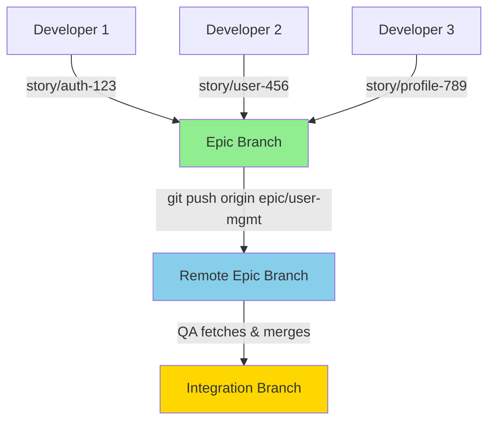

# 🔧 QA Branch Access Fix

## ❌ El Problema

QA estaba intentando acceder a **story branches** individuales cuando en realidad los Developers ya habían:
1. Mergeado todas las stories en la **epic branch**
2. Pusheado la epic branch al remoto
3. Las story branches ya no existen o no están actualizadas

Esto causaba que QA no pudiera ver el código committeado y reportara errores como "componente no existe" cuando claramente sí existía.

## ✅ La Solución

### 1. **QA ahora usa EPIC branches** (no story branches)
```typescript
// ANTES (INCORRECTO):
const epicBranches = stories.map((s: any) => s.branchName).filter(Boolean);
// Esto tomaba: ["story/auth-123-abc", "story/user-456-def"]

// AHORA (CORRECTO):
const epicBranches = epics.map((epic: any) => {
  const epicBranch = `epic/${epic.id}`;
  return epicBranch;
});
// Esto toma: ["epic/user-management", "epic/authentication"]
```

### 2. **Fetch all antes de merge**
```typescript
// Asegura que tenemos los últimos cambios del remoto
execSync(`cd "${primaryRepoPath}" && git fetch --all`);
```

## 📊 Flujo de Branches Corregido



## 🔄 Secuencia de Ejecución

1. **Developers Phase**:
   - Cada developer crea una story branch
   - Hace commits en su story branch
   - Al final, TODOS se mergean en la epic branch
   - Se pushea la epic branch

2. **QA Phase**:
   - Obtiene la lista de **epics** (no stories)
   - Genera nombres de epic branches: `epic/{id}`
   - Hace `git fetch --all` para obtener últimos cambios
   - Crea integration branch desde main
   - Hace merge de todas las epic branches
   - Ejecuta tests sobre el código integrado

## 🐛 Errores que esto soluciona

1. **"Component doesn't exist"** - QA ahora ve el código real committeado
2. **"Branch not found"** - QA busca las branches correctas (epic, no story)
3. **"Merge conflicts"** - Se hace fetch antes de intentar merge
4. **"Outdated code"** - QA trabaja con las branches pusheadas más recientes

## 📝 Cambios Realizados

### Archivo: `src/services/orchestration/QAPhase.ts`

**Líneas 107-131**: Cambió de obtener story branches a epic branches
```typescript
// Obtiene epics del EventStore
const epics = state.epics || [];

// Genera nombres de epic branches
const epicBranches = epics.map((epic: any) => {
  const epicBranch = `epic/${epic.id}`;
  return epicBranch;
});
```

**Líneas 179-187**: Agregado fetch antes de merge
```typescript
// Fetch latest changes from remote
execSync(`cd "${primaryRepoPath}" && git fetch --all`);
```

**Línea 192**: Usa las epic branches correctas
```typescript
const mergeResult = await this.githubService.mergeMultiplePRsLocally(
  primaryRepoPath,
  branchesToTest  // Epic branches, no story branches
);
```

## ✨ Resultado

QA ahora:
- ✅ Ve el código actualizado y committeado
- ✅ Puede hacer merge de las branches correctas
- ✅ Ejecuta tests sobre el código integrado real
- ✅ No reporta falsos positivos sobre componentes faltantes

---

*Fix implementado: December 2024*
*El problema era que QA intentaba usar story branches individuales cuando todo el código ya estaba mergeado en epic branches.*