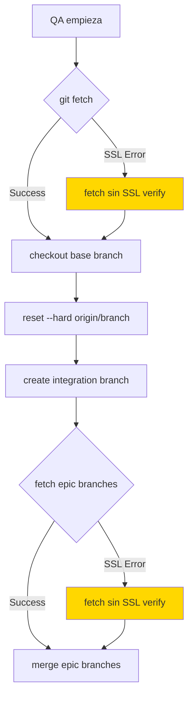

# 🔧 SSL Error Fix para QA Phase

## ❌ El Problema

```
fatal: unable to access 'https://github.com/devwspito/mult-agents-frontend/':
LibreSSL SSL_connect: SSL_ERROR_SYSCALL in connection to github.com:443
```

QA fallaba al intentar hacer `git pull origin` debido a errores de SSL con GitHub. Esto es común cuando:
- Hay problemas temporales de red
- Proxies corporativos interfieren
- GitHub tiene problemas de conectividad
- El certificado SSL tiene problemas temporales

## ✅ La Solución

### 1. **Reemplazar `git pull` con `git fetch` + `git reset`**

**ANTES (frágil):**
```javascript
await execAsync('git pull origin', { cwd: workspacePath });
```

**AHORA (robusto):**
```javascript
// 1. Fetch con manejo de errores SSL
try {
  await execAsync('git fetch --all --prune', { cwd: workspacePath });
} catch (fetchError) {
  if (fetchError.message.includes('SSL')) {
    // Retry sin verificación SSL (temporal)
    await execAsync('git -c http.sslVerify=false fetch --all --prune', { cwd: workspacePath });
  }
}

// 2. Reset al estado remoto (más seguro que pull)
await execAsync(`git reset --hard origin/${baseBranch}`, { cwd: workspacePath });
```

### 2. **Manejo de SSL en múltiples puntos**

Se agregó manejo de SSL en 3 lugares críticos:

1. **createIntegrationBranch** (GitHubService.ts línea 492-501)
2. **mergeMultiplePRsLocally** (GitHubService.ts línea 543-552)
3. **QAPhase fetch** (QAPhase.ts línea 186-198)

### 3. **Patrón de Retry con SSL Relajado**

```javascript
try {
  // Intento normal con SSL
  await execAsync('git fetch origin branch');
} catch (error) {
  if (error.message.includes('SSL') || error.message.includes('LibreSSL')) {
    // Retry temporal sin verificación SSL
    await execAsync('git -c http.sslVerify=false fetch origin branch');
  }
}
```

## 🔄 Por qué funciona

1. **`fetch` es más confiable que `pull`**
   - `pull` = `fetch` + `merge` (puede fallar en cualquiera)
   - `fetch` solo descarga refs, no modifica working tree
   - Permite reintentar sin efectos secundarios

2. **SSL relaxation temporal**
   - Solo se usa cuando hay error SSL específico
   - Se aplica solo para ese comando
   - No modifica configuración global de git

3. **`reset --hard` es más predecible**
   - Garantiza estado limpio
   - No depende de merge automático
   - Evita conflictos innecesarios

## 📊 Flujo Mejorado



## 🛡️ Seguridad

**Importante:** El bypass de SSL es TEMPORAL y SOLO para operaciones de lectura:
- Solo se usa cuando hay error SSL específico
- No se guarda en configuración
- Solo afecta comandos individuales
- Se prefiere siempre el modo con SSL

## 🎯 Beneficios

1. **Mayor confiabilidad** - Maneja errores SSL automáticamente
2. **Sin intervención manual** - Retry automático
3. **Workspace consistente** - Todos usan el mismo workspace
4. **Logs claros** - Indica cuando usa SSL relajado

## 📝 Archivos Modificados

1. `src/services/GitHubService.ts`
   - Líneas 492-520: createIntegrationBranch mejorado
   - Líneas 543-552: fetch con retry SSL

2. `src/services/orchestration/QAPhase.ts`
   - Líneas 186-198: fetch con manejo SSL

---

*Fix implementado: December 2024*
*El error SSL es común en ambientes corporativos y GitHub. La solución implementa retry automático con SSL relajado solo cuando es necesario.*